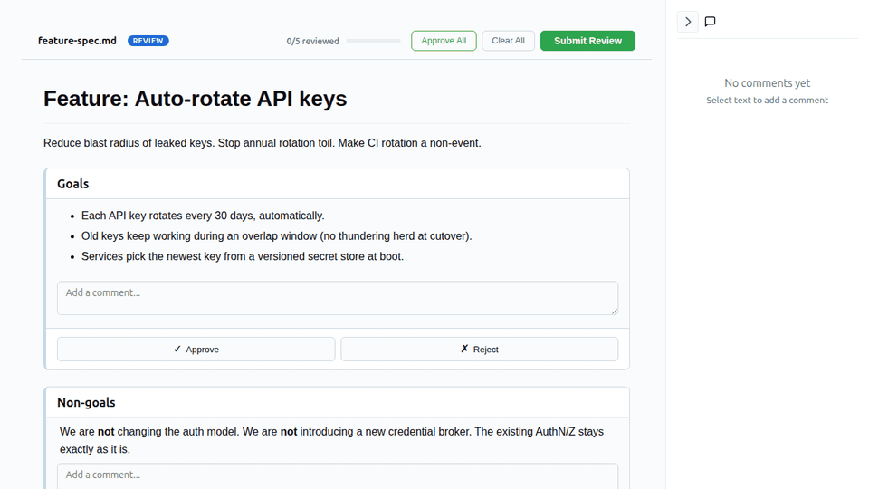

# md-review-plus

> **A collaboration runtime for AI agents and humans.** Your agent generates a
> markdown doc, a code diff, a design exploration, a prioritization board — and
> pipes it through `md-review-plus` for the human to actually _interact_ with.
> The reviewer drags, picks, approves, comments, and asks questions. Structured
> feedback comes back on stdout for the agent to act on.



End-to-end encrypted. Open source. Self-hostable. Works locally or over the
relay for SSH / mobile / cloud-CC use cases.

## Why

Most CLI review tools dump prose at you and ask "looks good?". Markdown
prose review is _one_ surface; the value compounds when reviewing also means
**choosing between rendered variants**, **anchoring feedback to a line**,
**dragging cards into priority columns**, or **tuning sliders against a live
preview**. None of that fits in a markdown buffer.

`md-review-plus` ships:

- the classic per-`##`-section markdown reviewer (with inline text-range comments)
- a **`window.mdrp` shim** that turns any single-file HTML artifact into a review surface
- **8 templates** Claude can fill in for the common review shapes (variant pick, code diff, prioritization, page-styling tuner, design-system review, …)
- a **bidirectional Q&A loop** — reviewers can ask the agent questions, the agent must answer next round
- **`--remote` mode** that ships either format over an end-to-end-encrypted relay so the reviewer can be on a different device/network than the CLI

## Install

```sh
npm install -g md-review-plus
md-review-plus install --skills [--global]   # install the Claude Code skill + templates
```

`install --skills` drops the skill at `~/.claude/skills/md-review-plus/` (with
`--global`) or `.claude/skills/md-review-plus/` (project-local), and copies
all eight templates next to it so Claude can grab one and fill it in.

## Quickstart

```sh
md-review-plus README.md --review             # markdown review, local browser
md-review-plus README.md --review --remote    # markdown review, encrypted relay URL
md-review-plus tuner.html --review            # HTML artifact review, local browser
md-review-plus tuner.html --review --remote   # HTML artifact, encrypted relay URL
```

`--review` blocks the CLI until the reviewer hits Submit; the structured
feedback is printed to stdout, then the CLI exits.

Exit codes: `0` = review submitted, `1` = browser closed without submitting or
session expired.

## Two modes

| Use case                                                  | File     | Mode                      |
| --------------------------------------------------------- | -------- | ------------------------- |
| Prose / spec / plan / linear narrative                    | `*.md`   | Markdown reviewer         |
| Code / patch / diff review with per-line comments         | `*.html` | `pr-review` template      |
| "Which of these do you prefer?" (variants, copy, layouts) | `*.html` | `design-grid` template    |
| Prioritization / ranking / what-ships-first               | `*.html` | `priority-board` template |
| Page-level live styling review (sliders → live preview)   | `*.html` | `style-review` template   |
| Design system / token review                              | `*.html` | `design-kit` template     |
| Tuning sliders/knobs against a single component           | `*.html` | `design-tuner` template   |
| Schema-driven config form                                 | `*.html` | `config-editor` template  |
| Concept-map / graph annotation                            | `*.html` | `concept-map` template    |
| Basic section-card layout for arbitrary HTML content      | `*.html` | `review-doc` template     |

Mode is inferred from the file extension. The markdown path is the
classic v1.3 reviewer with full per-section approve/reject + inline
text-range comments. HTML files go through the sandboxed artifact
runtime described next.

## HTML artifact mode

Every `.html` artifact renders inside an `<iframe sandbox="allow-scripts">`
with a strict CSP. The host page injects a tiny `window.mdrp` shim so the
artifact can talk back to the review surface:

```js
window.mdrp.ready({ title, chrome: 'host' | 'none', sections: [{id, heading}] });
window.mdrp.setSectionStatus(id, 'approved' | 'rejected' | 'pending');
window.mdrp.addComment({ sectionId, anchor?, text });
window.mdrp.addReaction({ targetId, emoji });    // 👍 👎 🤔 ❤️ 🎉 — per target
window.mdrp.askQuestion({ sectionId?, text });   // questions for the agent
window.mdrp.update(state);                        // arbitrary interactive state
window.mdrp.submit(stateOrNull);                  // optional artifact-driven submit
```

The shim is the only exit. The iframe can't `fetch`, can't load external
scripts, can't escape the sandbox. See the **Security model** section below.

### Templates

After `md-review-plus install --skills`, the templates ship to
`~/.claude/skills/md-review-plus/templates/`. Each is a self-contained
single-file HTML artifact with a `TEMPLATE_DATA` constant the agent fills
in. Header comment at the top of each file documents the fillins.

| Template              | Best for                                                                                                                                        |
| --------------------- | ----------------------------------------------------------------------------------------------------------------------------------------------- |
| `design-grid.html`    | Compare N rendered variants. Per-variant reactions, comment, ask-a-question, pin-to-element notes, winner radio                                 |
| `pr-review.html`      | Multi-file unified diff. Per-hunk approve/reject + severity tag + reactions. Per-line comments OR inline suggested edits                        |
| `priority-board.html` | Drag cards between Now / Next / Later / Cut. Editable titles, effort/impact chips, per-card comment + ask                                       |
| `style-review.html`   | Page-level styling review. Sliders/pickers for colors, type, spacing, radius drive a live preview via CSS variables. Click-to-pin element notes |
| `design-kit.html`     | Holistic design-system review. Palette, type ramp, spacing, radii, shadows, components — all driven by global tokens                            |
| `design-tuner.html`   | Single-component playground: sliders + live preview, apply to submit                                                                            |
| `config-editor.html`  | Schema-driven form with typed fields and inline validation                                                                                      |
| `concept-map.html`    | SVG concept map; each node is a section, click to annotate                                                                                      |
| `review-doc.html`     | Generic section-card layout for arbitrary HTML content                                                                                          |

Static screenshots of the four "rich" templates are in
[`docs/`](./docs/):
[design-grid](./docs/design-grid.png),
[pr-review](./docs/pr-review.png),
[priority-board](./docs/priority-board.png),
[style-review](./docs/style-review.png),
[design-kit](./docs/design-kit.png).

## What comes back on stdout

When the reviewer hits Submit, the CLI emits a structured markdown
report. Each block appears only when there's something to report:

```
## Needs Changes            — rejected sections + their comments
## Section Comments         — comments on approved/pending sections
## Line Comments            — per-line anchored notes; SUGGEST: … blocks are inline edit suggestions
## Approved                 — list of approved sections
## Open Questions           — questions the reviewer wants the agent to answer
## Reactions                — per-target emoji counts, e.g. **v2**: 👍×3 🎉
## Interactive State        — JSON state the artifact submitted (rankings, tuned values, picked winners)
```

The agent reads this, applies changes, answers the questions, and
optionally re-runs the review with the updated artifact.

## Remote review

For SSH / cloud / mobile / Claude-Desktop-on-iPad cases the local
browser isn't reachable. Add `--remote`:

```sh
md-review-plus ./document.md --review --remote
md-review-plus ./tuner.html --review --remote
```

The CLI:

1. encrypts the document with a fresh AES-256-GCM key
2. uploads the ciphertext to the relay
3. prints a URL with the key in the URL **fragment** (browsers do not send fragments to the server)

The reviewer opens the URL on any device, the browser decrypts the
ciphertext locally, the review happens, the reviewer submits, the CLI
receives encrypted feedback, decrypts it locally, and prints the
structured report to stdout — same exit-code contract as local mode.

Override the relay with `MDRP_RELAY` or `--relay <url>`. Self-host
instructions: [relay/README.md](./relay/README.md), [relay/DEPLOY.md](./relay/DEPLOY.md).

**Privacy:** AES-256-GCM end-to-end. The key never leaves the CLI or
the reviewer's browser. The relay holds ciphertext for up to 24h,
deletes on submit, and does not log request bodies or URL fragments.

## Claude Code integration

```sh
md-review-plus install --skills [--global]
```

The shipped skill teaches Claude:

- When to use markdown review vs HTML mode (decision table)
- Which template to pick for which review shape
- That open questions in `## Open Questions` are blocking — answer them in the next response
- How to surface the `--remote` URL on the first line of the reply (so the human sees it even if the agent's response is long)

Once installed, just say _"please review this remotely"_ and Claude
picks a template, fills it in, runs `--review --remote`, and surfaces
the URL.

## Security model

HTML artifacts run with these hardening defaults:

- `<iframe sandbox="allow-scripts">` — _no_ `allow-same-origin`, so the iframe is a separate origin from the host page and can't reach into the host's DOM
- Inline CSP: `default-src 'none'; script-src 'unsafe-inline'; style-src 'unsafe-inline'; img-src data:; font-src data:;`

In plain English, an HTML artifact cannot:

- make `fetch` / `XHR` / WebSocket calls — the relay never sees plaintext, but neither would _any_ network endpoint
- load remote scripts, stylesheets, fonts, or images
- navigate the parent page or submit forms across origins
- read or write the host page's DOM

The only exit is `parent.postMessage(...)` from the injected shim. Combined
with the E2E encryption in `--remote`, this means even a malicious
template would have no way to exfiltrate the document being reviewed.

## Roadmap / known limitations

- **`--remote` stdout is currently raw JSON** for HTML artifacts (the
  formatter only runs on the local server path). Extract `formatFeedback`
  to a shared module so `RemoteModeApp` can format client-side. ~30 lines.
- **No cross-iframe text-selection comments** for HTML artifacts yet.
  Markdown reviews have this via `SelectionPopover`; HTML needs a shim
  API for the iframe to expose selection events.
- **Bulk Approve/Reject doesn't fit every template** (pr-review, design-
  grid, priority-board own their own semantics). Templates need a way to
  opt out of the host's bulk controls.
- **`lineComments[].startLine` parser** doesn't handle the
  `line:<hunkId>:<n>` anchor format — falls back to `0`.

## License

[MIT](./LICENSE)

## Credits

`md-review-plus` is a fork of
[`md-review`](https://github.com/ryo-manba/md-review) by Ryo Matsukawa.
Thanks for the foundation.
